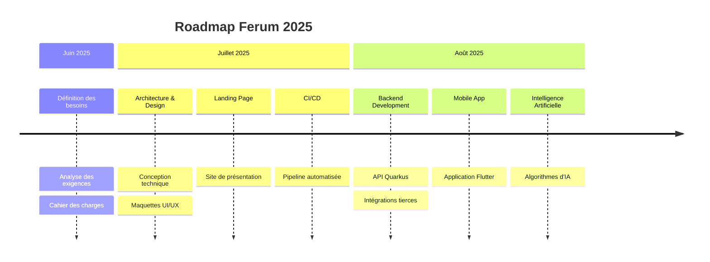

  
    
  
  
  
  
  
  **Révolutionnez votre expérience sportive avec Ferum : le réseau social qui combine planification d'entraînements personnalisés et communauté passionnée pour vous aider à atteindre vos objectifs.**

---

## 🌟 À propos du projet

Ferum est une plateforme innovante qui révolutionne l'expérience sportive en combinant :
- 🤖 **Algorithmie** pour des entraînements personnalisés
- 👥 **Réseau social sportif** pour une communauté active
- ⌚ **Intégration multi-appareils** (Garmin, Apple Watch, Wahoo)
- 📊 **Analytics avancées** pour optimiser vos performances

## 🏗️ Architecture & Repositories

### 📱 Frontend & Interface

  
| Repository | Description | Status | Technologies | **Accès** |
|------------|-------------|--------|-------------|------------|
| **[landing-page](https://github.com/ferum-pdg/landing-page)** | Site web de présentation |  |  | [url](http://83.228.200.235) |
| **[mobile-app](https://github.com/ferum-pdg/mobile-app)** | Application mobile Flutter | 🔄 En cours |  | - |

### 🛠️ Backend & Infrastructure

  
| Repository | Description | Status | Technologies |
|------------|-------------|--------|-------------|
| **[infrastructure](https://github.com/ferum-pdg/infrastructure)** | Configuration DevOps | - |  
| **[backend-api](https://github.com/ferum-pdg/backend-api)** | API REST Quarkus | 🔄 En cours |   |

### 📚 Documentation & Ressources

  
| Repository | Description | Status | 
|------------|-------------|--------|
| **[docs](https://github.com/ferum-pdg/docs)** | Documentation technique | 🔄 En cours |
| **[.github](https://github.com/ferum-pdg/.github)** | Configuration organisation | ✅ Terminé |

## 📅 Roadmap

## 👥 Équipe

  
| 👨‍💻 **Dario Vasques** | 👨‍💻 **Ewan Mariaux** | 👨‍🔬 **Guillaume Trüeb** | 👨‍🔬 **Gwendal Piemontesi** |
|:---:|:---:|:---:|:---:|
| DevOps & Mobile | DevOps & Mobile | Project Manager & Backend | Backend & AI Specialist |
| `Kubernetes` `Flutter` | `Kubernetes` `Flutter` | `Quarkus` `SvelteKit` | `AI/ML` `Quarkus` |
|  |  |  |  |

## 🔗 Liens utiles

  

---

  
**© 2025 Ferum - PDG - Projet de groupe, semestre d'été 2025**  
*Tous droits réservés*

